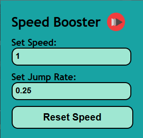

# YouTube Video Speed Enhancer

This script allows you to easily adjust the playback speed of YouTube videos using keyboard shortcuts.

## Features

- Increase video speed with the `+` key.
- Decrease video speed with the `-` key.
- Speed range: 0.0x to 10.0x.
- Change the speed jump rate using the popup

## Popup Screenshot

Below is a screenshot of the popup interface where you can adjust the speed jump rate:



## Installation Guide

Follow these steps to install the YouTube Video Speed Enhancer script in Chrome:

### Step 1: Download the code
```bash 
git clone https://github.com/AnisHerdev/youtube-video-speed-enhancer.git
```
- Or if you don't have git installed, then just download the zip file and extract it.

### Step 2: Install on chrome
1. First click on extension and then click on manage extensions.
2. Enable developer mode
3. Here click on Load unpacked.
4. Then select the folder you just downloaded.

### Step 3: Enjoy the freedom of choosing your own speed for the videos 😁😀

## Usage

- Press the `+` key to increase the video speed by 0.25x (default).
- Press the `-` key to decrease the video speed by 0.25x (default).
- The speed is capped between 0.0x and 10.0x.
- Open the popup and change the speed jump rate which is 0.25x by default.

## Customization

You can customize the default speed and speed increment by modifying the following variables in the script (youtube_speed_change.js):

```javascript
window.videoSpeed = 1.0; // Default playback speed
window.speedJump = 0.25; // Speed increment/decrement